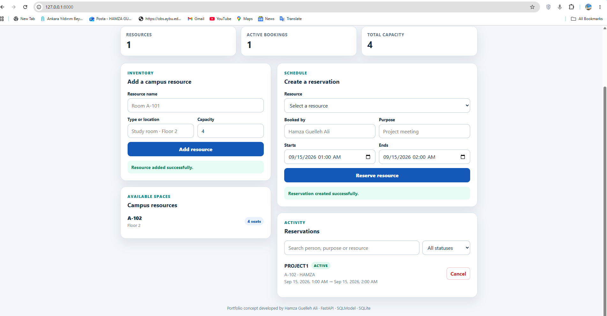
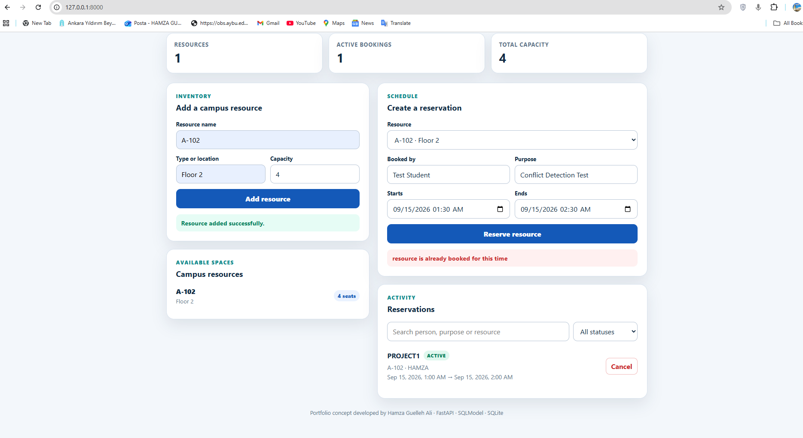
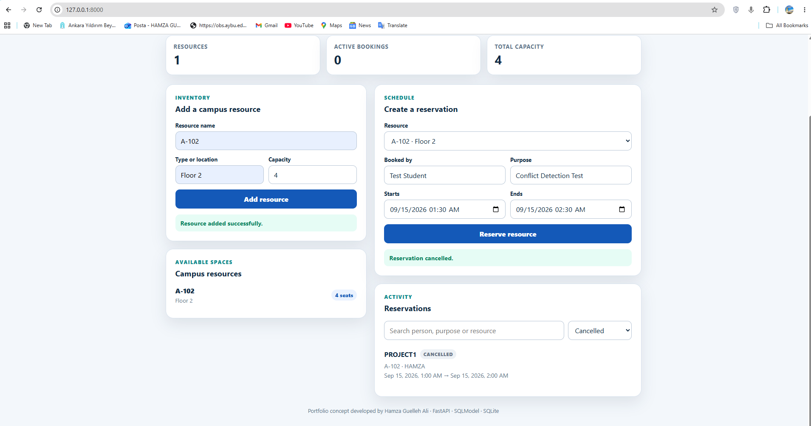

# CampusReserve

CampusReserve is a full-stack campus room and equipment reservation application built with FastAPI, SQLModel and SQLite. It provides a responsive browser dashboard, a documented REST API and automated tests for the core booking rules.

> **Portfolio disclosure:** the AYBU wording is a design concept for Hamza Guelleh Ali's student portfolio. This is not an official Ankara Yıldırım Beyazıt University service.

## Features

- Create and list study rooms, laboratories and shared equipment.
- Create, list and cancel reservations.
- Reject invalid intervals, missing resources and overlapping active bookings.
- Permit adjacent reservations and rebooking after cancellation.
- Dashboard statistics for resources, active bookings and total capacity.
- Search reservations and filter them by status.
- Responsive interface with accessible labels, success/error notices and status badges.
- Interactive OpenAPI documentation at `/docs`.
- Automated API tests and a GitHub Actions workflow.

## Technology

- Python 3.10+
- FastAPI and Uvicorn
- SQLModel and SQLite
- HTML, CSS and JavaScript without a frontend framework
- Pytest and HTTPX

## Setup on Windows

```powershell
py -3.12 -m venv .venv
.\.venv\Scripts\python.exe -m pip install -e ".[dev]"
.\.venv\Scripts\python.exe -m pytest -q
.\.venv\Scripts\campusreserve.exe
```

Open <http://127.0.0.1:8000>. Interactive API documentation is available at <http://127.0.0.1:8000/docs>.

## Setup on macOS or Linux

```bash
python3 -m venv .venv
.venv/bin/python -m pip install -e ".[dev]"
.venv/bin/python -m pytest -q
.venv/bin/campusreserve
```

## Demonstration checklist

1. Add a campus resource.
2. Create a one-hour reservation.
3. Attempt a second booking that overlaps the first and confirm the conflict message.
4. Cancel the first reservation.
5. Book the released time again.
6. Search the reservation list and filter by status.

The local database defaults to `campusreserve.db`. Set `CAMPUSRESERVE_DATABASE_URL` to use another SQLAlchemy database URL.

## Screenshots

### Dashboard and successful reservation



### Booking conflict detection



### Reservation cancellation




## Project structure

```text
src/campusreserve/
├── api.py             # REST endpoints and booking rules
├── database.py        # database engine and session lifecycle
├── main.py            # FastAPI application and CLI entry point
├── models.py          # SQLModel tables and validation models
└── static/index.html  # responsive browser dashboard
tests/test_api.py      # API and interface checks
```

## Current limitations

Version 0.2.1 is a local portfolio application. It has no authentication or staff/student roles and does not guarantee conflict prevention across simultaneous processes. A production version should use PostgreSQL transactions and database-enforced conflict protection. It should also add authentication, authorization, audit logs and deployment hardening.

## Attribution

The application uses FastAPI, SQLModel and Uvicorn. The researched [Full Stack FastAPI Template](https://github.com/fastapi/full-stack-fastapi-template) influenced the stack selection. See `THIRD_PARTY_NOTICES.md`.
